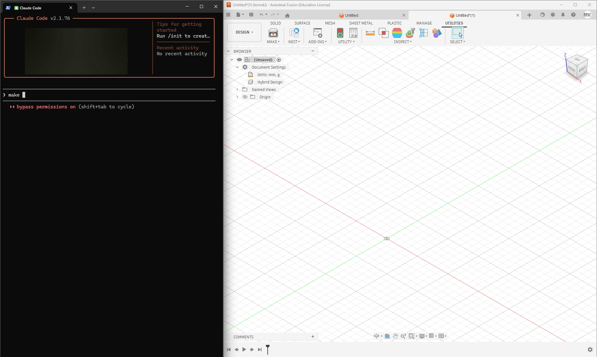

# TextToModel

**Turn natural language into 3D models in Fusion 360.**

An MCP (Model Context Protocol) server add-in that connects Claude to Autodesk Fusion 360 — giving you 64 CAD tools controllable through plain text.



---

## Highlights

- **Natural Language → CAD** — Describe what you want, Claude builds it in Fusion 360
- **64 MCP Tools** — Sketches, extrudes, fillets, sweeps, lofts, booleans, patterns, and more
- **JIS Standard Parts** — Generate bolts, nuts, screws, washers, keyways, bearings, and O-rings with accurate JIS dimensions (ISO equivalents planned)
- **Full Parametric Workflow** — Sketches → features → modifications → export (STEP/STL)
- **Works with Claude Desktop & Claude Code**

## Quick Start

### Prerequisites

- [Autodesk Fusion 360](https://www.autodesk.com/products/fusion-360)
- [Claude Desktop](https://claude.ai/download) or [Claude Code](https://docs.anthropic.com/en/docs/claude-code)
- [Node.js](https://nodejs.org/) (for `npx`)

### Installation

1. Clone this repo into Fusion 360's add-in directory:

```bash
# Windows
git clone https://github.com/mikan-atomoki/text-to-model.git "%APPDATA%\Autodesk\Autodesk Fusion 360\API\AddIns\TextToModel"

# macOS
git clone https://github.com/mikan-atomoki/text-to-model.git ~/Library/Application\ Support/Autodesk/Autodesk\ Fusion\ 360/API/AddIns/TextToModel
```

2. In Fusion 360: **UTILITIES → ADD-INS → Scripts and Add-Ins** → Run **TextToModel**

3. Connect to Claude:

**Claude Desktop** — add to your [MCP config](https://modelcontextprotocol.io/quickstart/user#configuring-claude-desktop) (`claude_desktop_config.json`):

```json
{
  "mcpServers": {
    "fusion360": {
      "command": "npx",
      "args": ["-y", "mcp-remote", "http://127.0.0.1:13405/sse"]
    }
  }
}
```

**Claude Code** — run:

```bash
claude mcp add fusion360-mcp --transport sse http://127.0.0.1:13405/sse
```

That's it. Open Claude and start modeling.

## Examples

```
Create an M8x30 hex socket head bolt at the origin
```

```
Draw a 50mm × 30mm rectangle on the XY plane, extrude it 20mm,
and add a 3mm fillet to the top long edges
```

```
Draw a 20mm diameter circle, create a revolve, then add a keyway
```

## Tool Categories (64 tools)

| Category | Count | Tools |
|----------|-------|-------|
| **Sketch** | 7 | circle, rectangle, line, arc, spline, polygon, create sketch |
| **Features** | 4 | extrude, revolve, sweep, loft |
| **Modify** | 6 | fillet, chamfer, shell, mirror, variable fillet, draft |
| **Patterns & Combine** | 3 | circular/rectangular pattern, boolean combine |
| **JIS Fasteners** | 4 | bolt, nut, screw, washer (with JIS standard dimensions) |
| **JIS Holes** | 3 | threaded hole, counterbore, countersink |
| **Mechanical** | 3 | keyway (B1301), bearing hole (B1520), O-ring groove (B2401) |
| **Construction** | 4 | offset/angled/mid plane, construction axis |
| **Inspect** | 5 | list edges/faces/sketches/planes, bounding box |
| **Surface** | 4 | patch, thicken, offset, boundary fill |
| **Split** | 2 | split body, split face |
| **Transform** | 3 | move, scale, copy |
| **Import** | 2 | SVG, DXF |
| **Constraints** | 3 | geometric constraint, dimension, list entities |
| **Appearance** | 2 | body color, rename body |
| **Utility** | 9 | design info, list bodies/components, parameters, undo, export STEP/STL, execute code |

## Architecture

```
Claude Desktop/Code ←→ MCP (HTTP/SSE) ←→ Bridge (CustomEvent) ←→ Fusion 360 API
```

The add-in runs an HTTP/SSE server inside Fusion 360. Claude sends tool calls via MCP protocol, and the bridge executes them on Fusion's main thread using a CustomEvent-based synchronization mechanism.

## License

MIT

---

<details>
<summary>🇯🇵 日本語</summary>

Fusion 360 を Claude Desktop/Code から直接操作できる MCP サーバーアドイン。
テキストの指示だけで 3D モデリング・JIS 規格部品の生成が可能です。

64種類のMCPツールで、スケッチ作成・押し出し・フィレット・JIS ボルト生成など、幅広いCAD操作をテキスト指示で実行できます。

セットアップ方法や詳細は英語版をご参照ください。

</details>
